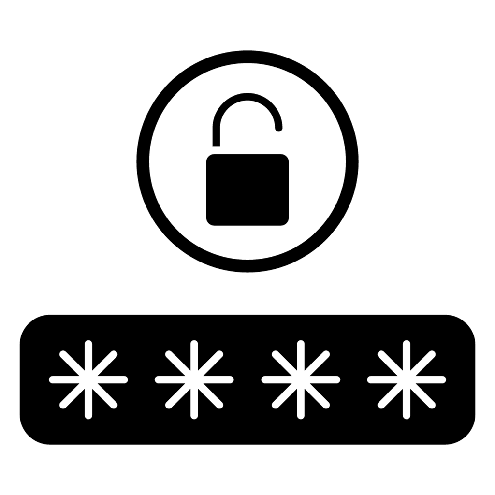

# Generador de Contraseñas Seguras - Extensión de Chrome

Una extensión de navegador para Chrome que permite a los usuarios generar contraseñas seguras y personalizables con facilidad.

## Características

- **Personalización Completa**: Elige entre mayúsculas, minúsculas, números y caracteres especiales.
- **Selección de Longitud**: Decide cuán larga quieres que sea tu contraseña.
- **Copiado Rápido**: Con un solo clic, copia la contraseña generada al portapapeles.

## Instalación

1. Clona este repositorio o descarga el código fuente.
2. Abre Chrome y ve a `chrome://extensions/`.
3. Habilita el modo desarrollador.
4. Haz clic en "Cargar extensión sin empaquetar" y selecciona la carpeta de la extensión.

Alternativamente, puedes descargar e instalar la extensión directamente desde la Chrome Web Store. (Añade el enlace una vez que esté publicado).

## Uso

1. Haz clic en el ícono de la extensión en la barra de herramientas de Chrome.
2. Selecciona las opciones deseadas.
3. Presiona "Generar" para obtener una contraseña segura.
4. Usa el ícono del portapapeles para copiar la contraseña.

## Contribuciones

Las contribuciones son bienvenidas. Si encuentras un error o tienes alguna sugerencia, por favor abre un issue o envía un pull request.

## Licencia

MIT License. Ver el archivo [LICENSE](LICENSE) para más detalles.

## Agradecimientos

Agradezco a todos los que han proporcionado feedback y han contribuido a este proyecto.

---

Desarrollado con ❤️ por [Radega](https://radega.com)
